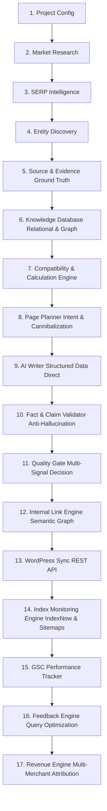

# OpenSEO — Data Authority Engine

> **A Next-Generation Programmatic Authority Platform** replacing generic thin-affiliate AI content with verifiable ground-truth entities, source provenance, deterministic engineering calculations, and strict anti-hallucination quality gates.

---

## 🏗️ Architecture Overview

The system operates on an evidence-first, multi-stage pipeline designed to satisfy Google Search Quality Rater Guidelines, EEAT, and Search Console feedback loops:



### The 17 Core Stages:

1. **Project & Taxonomy**: Project-level configuration, niche selection, target markets, and brand entities.
2. **Market Research**: Demand scanning, volume estimation with provenance labels (`REAL`, `ESTIMATED`, `HEURISTIC`, `MODELLED`).
3. **SERP Intelligence**: SERP Opportunity Score with transparent signal breakdowns (No fake outrank guarantees).
4. **Entity Discovery**: Extraction of physical products, vehicles, equipment, and specifications into canonical models.
5. **Source & Evidence**: Ground truth collection from official manufacturer manuals, spec sheets, NHTSA, EPA, and laboratory records with URL provenance.
6. **Knowledge Database**: Relational PostgreSQL/SQLite schema storing entities, attributes, relationships, claims, and audit logs.
7. **Compatibility & Calculation Engine**: Deterministic engineering math (Ohm's law, battery runtime, cargo volume fit, thermal duty cycle) with parameter logging.
8. **Page Planner**: Multi-intent clustering, cannibalization detection, and explicit lifecycle routing (`CREATE`, `MERGE`, `UPDATE_EXISTING`, `NOINDEX`, `SKIP`). No fixed ratio dogmas.
9. **AI Writer**: Structured injection of verified database facts, specifications, comparison tables, and calculations directly into article sections.
10. **Fact & Claim Validator**: Enforces Rule 10 (prohibits fake hands-on testing claims like *"we tested in our lab"* without verifiable lab records) and flags source numerical conflicts.
11. **Quality Gate**: Multi-signal scoring (source coverage, authority, factual consistency, compliance) determining `PASS`, `NEEDS_REVISION`, or `FAIL`. Word count is non-primary.
12. **Internal Link Engine**: Semantic entity hub-and-spoke graph linking, anchor diversity, and context relevance.
13. **WordPress Sync**: REST API publishing with Gutenberg block compatibility, featured image optimization, and metadata injection.
14. **Index Monitoring Engine**: Fast indexing submission via IndexNow API protocol, sitemap verification, and HTTP/robots indexability checks.
15. **GSC Performance Tracker**: Ingestion of Google Search Console impressions, clicks, CTR, and average positions by URL and query.
16. **Feedback Engine**: Striking distance opportunity detection (e.g. positions 11–20 with high impressions) routed directly to `OPTIMIZE_EXISTING_PAGE` rather than generating cannibalizing new posts.
17. **Revenue Engine**: Multi-merchant offer tracking (Manufacturer Direct, Amazon, eBay, Specialized Retailers) with FTC compliance and out-of-stock monitoring.

---

## 🧪 Verification & Automated Testing

The Data Authority Engine includes a comprehensive automated test suite verifying anti-hallucination gates, deterministic calculations, compatibility logic, and feedback loops:

```bash
# Run the complete test suite
python -m pytest tests/ -v
```

### Test Suite Breakdown:
- **`tests/test_anti_hallucination.py`**:
  - Rejection of unsupported vehicle dimensions.
  - Interception of prohibited hands-on testing claims (*Rule 10*).
  - Source discrepancy conflict flagging (>5% variance).
  - Clean error bubbling on retrieval failure without fake fallback injection.
- **`tests/test_calculation.py`**: Deterministic power station and 12V fridge runtime calculations.
- **`tests/test_compatibility.py`**: Physical vehicle cargo dimensions vs fridge fit verification.
- **`tests/test_evidence_provenance.py`**: Ground-truth provenance verification for Subaru Outback 2025 and ICECO VL45.
- **`tests/test_page_planner.py`**: 5 near-duplicate keyword clustering and duplicate URL detection.
- **`tests/test_quality_gate.py`**: Rejection of 4,000-word ungrounded AI spam vs acceptance of 800-word grounded technical articles.
- **`tests/test_gsc_feedback.py`**: Enforcing existing page optimization for striking distance queries.
- **`tests/test_end_to_end_dryrun.py`**: Complete pipeline dry-run integration test.

---

## 🛠️ Installation & Setup

### 1. Requirements
- Python 3.10+ (Tested on Python 3.12)
- SQLite3 or PostgreSQL

### 2. Install Dependencies
```bash
pip install -r requirements.txt
pip install pytest pytest-asyncio
```

### 3. Environment Configuration
Copy the `.env.example` file and configure your credentials:
```bash
cp .env.example .env
```
Key configuration parameters:
- `DATABASE_URL`: `sqlite:///./data/authority_engine.db`
- `LLM_PROVIDER`: `gemini` | `anthropic` | `openai`
- `WP_URL`: Target WordPress REST API base URL
- `INDEXNOW_KEY`: Key for Bing/Yandex IndexNow submissions

### 4. Database Initialization
```bash
python -c "from core.database import init_db; init_db()"
python -c "from core.niche_adapters.vehicle_camping import seed_ground_truth; seed_ground_truth()"
```

### 5. Launch Web Dashboard
```bash
python main.py ui
```
Access the dashboard at `http://localhost:8000`.

---

## 📦 Database Schema Models

The database architecture (`core/database.py`) consists of 17 relational models:
1. `projects`: Project configurations and target niches.
2. `entities`: Canonical real-world entities (vehicles, power stations, fridges, solar panels).
3. `sources`: Authoritative ground-truth source documents with reliability ratings.
4. `source_claims`: Raw factual claims extracted directly from source documents.
5. `entity_attributes`: Verified key-value attributes with unit normalization.
6. `attribute_definitions`: Canonical schema types, measurement units, and tolerance constraints.
7. `entity_relationships`: Graph relationships (fits_inside, powers, requires_cable).
8. `merchant_offers`: Multi-merchant pricing, availability, and affiliate links decoupled from product entities.
9. `calculation_logs`: Full audit logs of math formulas, input parameters, and assumptions.
10. `page_plans`: Content strategy plans with intent routing and cannibalization tags.
11. `page_quality_evaluations`: Multi-signal quality gate audit results.
12. `claim_validations`: Content verification records against forbidden claims and fact mismatches.
13. `articles`: Generated articles with revision history and publishing status.
14. `internal_links`: Graph of site-wide internal link topology and anchors.
15. `gsc_metrics`: Historical Google Search Console impression and position records.
16. `indexer_logs`: IndexNow and search engine submission audit logs.
17. `audit_logs`: System-wide audit trail for pipeline executions and configuration changes.

---

## ⚠️ Legacy Pipeline (Deprecated / Maintenance Mode)

> **Notice**: The legacy single-run pipeline below is retained for backward compatibility with existing automated cron tasks. It is in maintenance mode and is scheduled to be superseded by the Data Authority Engine.

### Legacy CLI Commands:
```bash
# Long-tail autocomplete keywords
python main.py find-keywords "office chair" --limit 20 --output topics.csv

# Single product Amazon analysis
python main.py analyze-product B08N5WRWNW

# Legacy generator (thin-affiliate style)
python main.py generate --keyword "ergonomic office chairs" --asins "B08N5WRWNW,B07J281VDD" --dry-run

# Batch CSV runner
python main.py batch --file topics.example.csv
```
