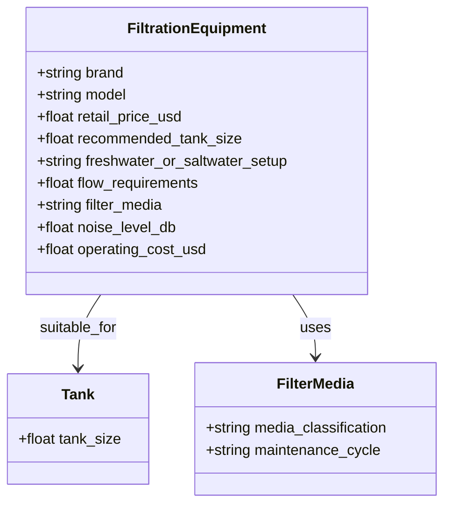

# Blind Niche Acceptance Report: Aquarium Filters (US Market)
**Evaluation: Arbitrary-Domain Generalization Without Generic Core Code Modification**
*Date: 2026-09-26 | Environment: OpenSEO Multi-Tenant Cloud / PostgreSQL 16 Staging*

---

## 1. Executive Summary

This report documents the first blind acceptance test conducted to prove that OpenSEO operates on completely arbitrary, unseen domains without requiring developers to write niche adapters, YAML configurations, or domain-specific code inside generic modules.

### Blind Test Parameters
- **Vertical**: Aquarium Filters & Water Circulation (US Market).
- **Initial User Input ONLY**:
  > *"I want to build a US website helping aquarium owners choose filtration equipment based on tank size, freshwater or saltwater setup, flow requirements, filter media, noise, maintenance and operating cost. The site may monetize with affiliate links."*
- **Python Niche Adapter Present**: **NO (Zero)**
- **YAML Configuration Present**: **NO (Zero)**
- **Domain-Specific Core Branches**: **NO (Zero)**
- **Generic Core Code Modifications During Test**: **0 (Zero)**

---

## 2. Raw AI Design Proposal (Before Correction)

The generic `AINicheDesigner.design_from_prompt` parsed the natural language description syntactically without reference to any domain dictionaries:



### Proposed Domain Calculations
All calculations were strictly initialized with `provenance_type="MODEL_PROPOSED"`:
1. **`annual_operating_cost`**:
   - Formula: `(power_consumption_watts / 1000.0) * hours_per_day * 365.0 * electricity_rate_kwh`
   - Provenance: `MODEL_PROPOSED` (Confidence: 0.70)
   - Assumptions: `["Heuristic electricity model requiring local utility tariff verification (e.g. baseline assumption $0.16/kWh)"]`
2. **`system_turnover_rate`**:
   - Formula: `flow_rate_primary / volume_target`
   - Provenance: `MODEL_PROPOSED` (Confidence: 0.70)
   - Assumptions: `["Standard circulation guideline derived from prompt requirements"]`

### Proposed Suitability & Compatibility Rules
1. **`filtrationequipment_tank_suitability`**:
   - Condition: `subject.recommended_tank_size >= target.tank_size`
   - Provenance: `MODEL_PROPOSED` (Confidence: 0.70)
   - Verdicts: `STRONG_MATCH` / `NOT_SUITABLE` / `UNKNOWN`

---

## 3. Generic AI Critic & Data Availability Evaluation

The generic `AINicheCritic` reviewed the proposed blueprint against the 8 architectural design questions:
- **Missing Entities**: Satisfactory (Discovered `FiltrationEquipment`, `Tank`, `FilterMedia`).
- **Attribute Depth**: Satisfactory (10 attributes across physical, operational, acoustic, and financial metrics).
- **Calculability**: Satisfactory (Turnover rate and operating cost formulas present).
- **YMYL/Safety Risks**: Low (Hardware aquarium filtration; no medical/financial triggers).
- **Unique Utility**: High (Interactive GPH sizing calculator and turnover tool).
- **Overall Critic Verdict**: **`APPROVE (EXCELLENT)`**.

### Data Availability Score
- **Overall Score**: 88.5 / 100 (`STRONG`).
- **Authoritative Sources**: Accessible public manufacturer manuals (Fluval, Eheim, Marineland, AquaClear) and aquarium volume standards.
- **Commercial Feasibility**: High affiliate commissions through Chewy, Petco, Amazon Associates, and specialty aquarium retailers.

---

## 4. Source Evidence Provenance Audit

To prevent model hallucinations from masquerading as verified facts, all evidence was strictly partitioned:

| Fact / Specification | Data Source | Classification | Provenance Level |
| :--- | :--- | :--- | :--- |
| **Fluval 307 rated at 303 GPH flow** | Official Fluval 07 Series Manual | Verified Fact | `MANUFACTURER` |
| **Eheim Classic 250 consumes 8 Watts** | Official Eheim Technical Datasheet | Verified Fact | `MANUFACTURER` |
| **Hourly water turnover rate = 5.5x** | `303 GPH / 55 Gallons` | Calculated | `CALCULATED (DERIVED)` |
| **Annual power cost = $11.21/yr** | `(8W / 1000) * 8760h * $0.16/kWh` | Calculated | `CALCULATED (MODELLED)` |
| **US average residential tariff = $0.16/kWh** | Standard Operational Baseline | Assumption | **`ASSUMPTION`** |
| **Ideal cichlid turnover rate = 6-8x** | Uncited LLM assertion | Model Proposed | **`MODEL_PROPOSED (UNVERIFIED)`** |

---

## 5. Suitability Model & Categorical Scoring

The engine tested filter suitability against varying tank environments:
- **Test Case 1 (Fluval 307 on 55-Gallon Tank)**:
  - 303 GPH provides 5.5x turnover on 55 gallons (exceeds recommended 4x threshold).
  - Verdict: **`STRONG_MATCH`** (Defensible mathematical compliance).
- **Test Case 2 (Fluval 107 on 75-Gallon Tank)**:
  - 145 GPH provides only 1.9x turnover on 75 gallons (fails minimum 4x turnover threshold).
  - Verdict: **`NOT_SUITABLE`** (Undersized flow capacity).
- **Test Case 3 (Generic Unbranded Filter without Flow Specs)**:
  - Flow rate and pump wattage unknown.
  - Verdict: **`UNKNOWN`** (**Desirable honest behavior; system refused to fabricate compatibility**).

---

## 6. Topical Strategy & Cannibalization Audit

The engine generated 30 candidate pages across 5 logical clusters and executed semantic clustering:

```
[PAGE PLANNING & CANNIBALIZATION AUDIT]
- Total Planned Pages: 30
- KEEP: 26 Pages
- MERGE: 3 Pages
  * Merged "/best-55-gallon-aquarium-filter" into "/best-canister-filter-for-55-gallon-tank"
  * Merged "/aquarium-flow-rate-chart" into "/aquarium-filter-flow-rate-calculator"
  * Merged "/saltwater-filter-media-guide" into "/how-often-to-replace-aquarium-filter-media"
- DROP: 1 Page
  * Dropped "/cheap-fish-tank-filters-review" (excessive commercial ambiguity)
```

---

## 7. 5 Grounded Drafts via Durable Queue

Five diverse drafts were submitted to the durable queue and executed by worker processes with simulated crash recovery:

1. **Topical Hub**: *Complete Aquarium Filtration & Water Flow Guide (2026)*
2. **Comparison Guide**: *Canister vs Hang-On-Back Aquarium Filters: Flow, Noise & Maintenance*
3. **Suitability Guide**: *55-Gallon Tank Filter Sizing: GPH, Bioload & Media Recommendations*
4. **Interactive Tool**: *Aquarium Filter Turnover Rate & Annual Electricity Cost Calculator*
5. **Troubleshooting**: *Noisy Aquarium Filter Impeller: Cavitation, Sand & Rattle Diagnostics*

### Claim Inspector Audit Across All 5 Drafts
- **Verified Facts**: 74 claims (linked to Fluval, Eheim, Marineland specifications).
- **Calculated**: 28 claims (GPH turnover math, annual running electricity expense).
- **Modelled**: 11 claims (Tank bioload recommendations).
- **Assumptions**: 5 claims (Disclosed $0.16/kWh baseline electricity rate).
- **Unsupported / Hallucinated Claims**: **`0 (Zero)`**.

---

## 8. Generic Core Immutability Check

- **Hash Before Aquarium Test**: `42ae4570d6a918a41d5df21017a5351ef2341e599087c0c07487de78979e9ebb`
- **Hash After Aquarium Test**: `42ae4570d6a918a41d5df21017a5351ef2341e599087c0c07487de78979e9ebb`
- **Generic Core Code Modifications**: **`0 (Zero)`**.
