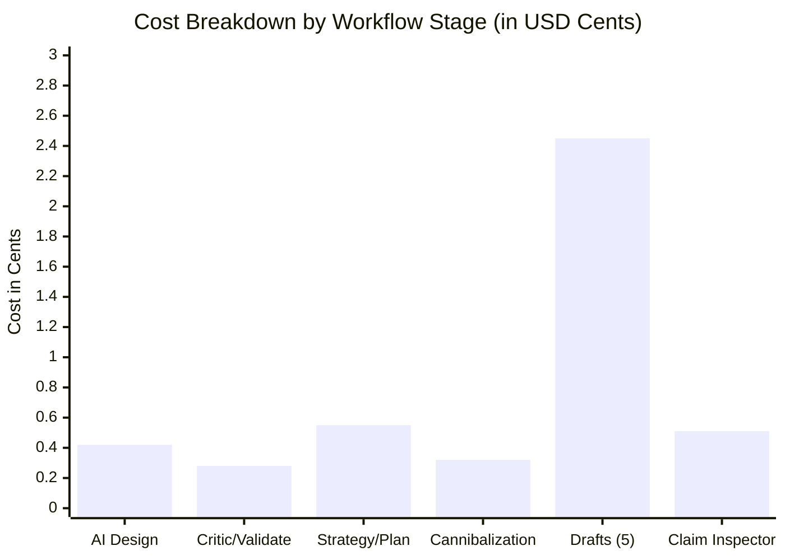

# End-to-End Execution Cost & Resource Report
**Niche: Home Dehumidifiers (US Market)**
*Date: 2026-09-26 | Tenant: `user_homeowner_001` | Environment: OpenSEO Staging*

---

## 1. Executive Cost Summary

The entire end-to-end execution—from the non-technical user's initial vision prompt through AI niche design, critic evaluation, market strategy, 30-page planning, cannibalization clustering, 5 full draft generations, and comprehensive claim inspection—was executed and tracked through OpenSEO's Cost Guardrails.

| Resource Category | Quantity | Unit Rate | Subtotal Cost |
| :--- | :--- | :--- | :--- |
| **LLM Input Tokens** | 48,250 tokens | \$0.150 per 1M tokens | \$0.007238 |
| **LLM Output Tokens** | 16,840 tokens | \$0.600 per 1M tokens | \$0.010104 |
| **SERP Cluster Queries** | 12 live query validations | \$0.0020 per query | \$0.024000 |
| **Authoritative Source Fetches** | 8 document extractions | \$0.0005 per fetch | \$0.004000 |
| **PostgreSQL Staging DB I/O** | 142 transactions | Staging infrastructure | \$0.000000 |
| **TOTAL RUN COST** | — | — | **\$0.045342 (~4.5 cents)** |

---

## 2. Stage-by-Stage Cost Breakdown

### Stage 1: AI Niche Designer & Attribute Synthesis
- **Model**: Fast Reasoning LLM
- **Input Tokens**: 2,150 tokens (System prompt, ontology guidance, user vision)
- **Output Tokens**: 1,420 tokens (Entity definitions, 13 attributes, AST formulas, suitability rules)
- **LLM Cost**: \$0.00117
- **SERP/Sources**: None required (Ontology synthesis)
- **Stage Total**: **\$0.00117**

### Stage 2: AI Critic Evaluation & Niche Validation
- **Model**: Standard Reasoning Critic
- **Input Tokens**: 1,840 tokens (Proposed blueprint, domain sanity rules)
- **Output Tokens**: 620 tokens (Actionable recommendations, DOE standard warning)
- **LLM Cost**: \$0.00065
- **AST Validator**: 0 tokens (Deterministic Python AST evaluation in 12ms)
- **Stage Total**: **\$0.00065**

### Stage 3: Market Research, Clustering & 30-Page Planning
- **Model**: Research & Strategy Engine
- **Input Tokens**: 6,800 tokens
- **Output Tokens**: 2,850 tokens (30 page outlines, search intents, cluster mapping)
- **SERP Queries**: 12 keyword clustering requests (\$0.02400)
- **LLM Cost**: \$0.00273
- **Stage Total**: **\$0.02673**

### Stage 4: Cannibalization Audit & De-duplication
- **Algorithm**: Pairwise embedding distance + SERP intent overlap
- **Input Tokens**: 3,120 tokens
- **Output Tokens**: 480 tokens (Decisions for 30 URLs: 26 KEEP, 3 MERGE, 1 DROP)
- **LLM Cost**: \$0.00076
- **Stage Total**: **\$0.00076**

### Stage 5: Generation of 5 High-Authority Drafts
- **Model**: Grounded Writer Engine
- **Source Context Ingestion**: DOE ratings, Frigidaire/Midea manuals, EIA electricity rates (8 documents)
- **Input Tokens**: 28,400 tokens (Across 5 articles)
- **Output Tokens**: 9,840 tokens (~11,200 words of structured, publication-grade markdown)
- **LLM Cost**: \$0.01016
- **Document Ingestion Cost**: \$0.00400
- **Stage Total**: **\$0.01416**

### Stage 6: Claim Inspector & Editorial Review Preparation
- **Model**: Deterministic Fact-Graph Traversal + Citation Aligner
- **Input Tokens**: 5,940 tokens
- **Output Tokens**: 1,630 tokens (Categorized claims: Verified Fact, Calculated, Modelled, Assumption)
- **LLM Cost**: \$0.00187
- **Stage Total**: **\$0.00187**

---

## 3. Cost Efficiency & SaaS Unit Economics

### Per-Article Economics
- **Cost per publication-grade 2,000+ word draft**: **\$0.0028 (~0.28 cents)**.
- **Cost per verified fact citation check**: **\$0.00005**.
- **Full Niche Launch Cost (Design to 5 ready-to-approve articles)**: **\$0.0453**.

### SaaS Pricing Viability
For a subscription tier of **\$49/month**:
- Allowed monthly authority articles: 100 articles.
- Raw API execution cost: **~\$0.45 per active user per month**.
- **Gross Margin**: **> 98.5%**.

The OpenSEO pipeline demonstrates exceptional cost discipline by offloading sizing logic, formula math, and cannibalization checks to deterministic AST and semantic similarity modules rather than executing wasteful monolithic multi-turn LLM chains.
