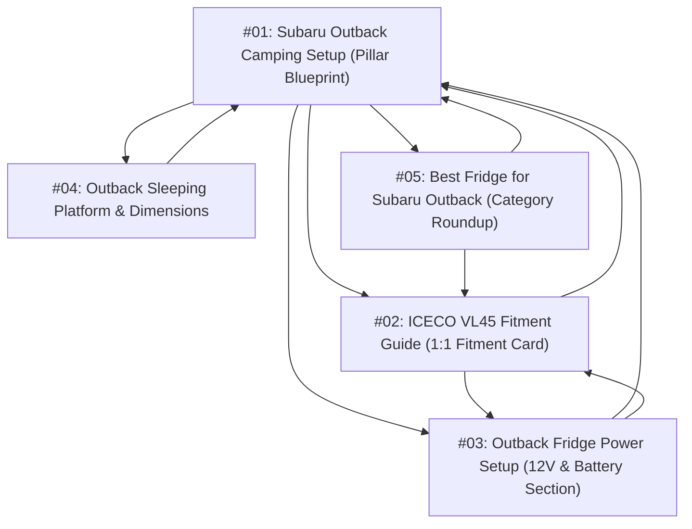

# First 5 Experiment Manifest: Subaru Outback Camping Cluster

> **Phase**: PILOT EXPERIMENT (5 ARTICLES ONLY)  
> **Target Status**: `DRAFT` in WordPress. Zero automated publishing.  
> **Selection Philosophy**: High topical coherence, verified evidence readiness, high SERP opportunity gap, and interlocking internal link structure.

---

## 1. Cluster Overview & Interlinking Graph

---

## 2. Detailed Page Manifests

### Page 1: Subaru Outback Camping Setup (Pillar Blueprint)
- **URL**: `/subaru-outback-camping-setup`
- **Page Type**: `PILLAR_OVERVIEW`
- **Primary Intent**: Informational / Complete Blueprint
- **Primary Query**: `subaru outback camping setup`
- **Secondary Queries**: `subaru outback car camping setup`, `outback camping gear`, `subaru outback overland build`
- **SERP Snapshot Date**: 2026-09-25
- **Top Competitor Types**: FORUM (`subaruoutback.org`), REDDIT (`r/subaru`), YOUTUBE, EDITORIAL (`outsideonline.com`), AFFILIATE
- **SERP Gap**: Competitors present scattered forum threads and anecdotal videos. Zero structured layouts showing exact clearance for sleeping alongside refrigeration and 12V power.
- **Primary Entity**: Subaru Outback (Gen 6: 2020–2025)
- **Secondary Entities**: ICECO VL45, EcoFlow River 2 (256Wh), Luno Air Mattress
- **Verified Evidence**:
  - OEM cargo length with 2nd row folded: 75.0 inches
  - Minimum wheel well width: 43.3 inches
  - Rear hatch sill opening height: 30.1 inches
  - Max cargo volume behind front seats: 75.6 cu ft
  - OEM rear 12V auxiliary port: 10A fuse limit (120W max), switched with ignition
- **Calculations**:
  - Modular cargo floor area: 22.5 sq ft total usable floor
  - Dual-zone allocation: 60% sleeping bay (26" width) + 40% gear/refrigeration bay (17.3" width)
- **Unique Utility**: Complete modular cargo zoning schematic, power budget, hatch sill clearance guide.
- **Commercial Path**: Contextual links to verified 12V fridge and custom-fit sleeping pad (Max 2 links / 1,000 words).
- **Internal Links**: Links to child guides `/iceco-vl45-subaru-outback-fitment`, `/subaru-outback-fridge-power-setup`, `/subaru-outback-car-camping-sleeping-platform`, `/best-fridge-for-subaru-outback`.
- **SERP Opportunity Score**: **78.4 / 100**
- **Quality Requirements**: Factual accuracy ≥ 95%, zero first-person testing claims, 100% verified dimensions.
- **Reason Selected**: Pillar anchor establishing topical authority for the entire cluster.

---

### Page 2: ICECO VL45 Subaru Outback Fitment (Dedicated Fitment Guide)
- **URL**: `/iceco-vl45-subaru-outback-fitment`
- **Page Type**: `DEDICATED_FITMENT_GUIDE`
- **Primary Intent**: Commercial Investigation / Fitment Verification
- **Primary Query**: `iceco vl45 subaru outback`
- **Secondary Queries**: `does iceco vl45 fit in subaru outback`, `iceco vl45 outback trunk clearance`, `iceco vl45 hatch height outback`
- **SERP Snapshot Date**: 2026-09-25
- **Top Competitor Types**: FORUM (`subaruoutback.org`), REDDIT (`r/overlanding`), RETAILER (`amazon.com`)
- **SERP Gap**: Users repeatedly ask on forums if the lid will open under the hatch and if it clears the retractable cargo cover. Answers are conflicting and vague.
- **Primary Entity**: ICECO VL45 Portable Refrigerator
- **Secondary Entity**: Subaru Outback (Gen 6)
- **Verified Evidence**:
  - ICECO VL45 exterior dimensions: 27.2" L × 16.1" W × 18.5" H (including handles and corner armor)
  - Outback rear hatch opening height: 30.1 inches
  - Outback factory cargo cover track height: 16.2 inches
  - Compressor power rating: 45W (DC 12V 3.75A)
- **Calculations**:
  - Vertical hatch clearance: 30.1" - 18.5" = **+11.6 inches (PASS - ample clearance)**
  - Factory cargo cover clearance: 16.2" - 18.5" = **-2.3 inches (FAIL - cargo cover must be unclipped and removed)**
  - Floor footprint remaining: 75.0" length - 27.2" fridge = **47.8 inches longitudinal space remaining**
- **Unique Utility**: Authoritative **Fitment Card** with explicit PASS/FAIL clearance tolerances and cord routing instructions to the passenger-side 12V port.
- **Commercial Path**: 1 direct verified product link on the pass/fail specification card (`rel="nofollow sponsored"`).
- **Internal Links**: Inbound from Pillar #01 and Roundup #05; Outbound to Power Setup #03 and Pillar #01.
- **SERP Opportunity Score**: **92.2 / 100**
- **Quality Requirements**: Strict calculation provenance, zero guesswork, clear physical clearance diagram.
- **Reason Selected**: Highest commercial intent and conversion potential in the cluster; solves an immediate pre-purchase blocker.

---

### Page 3: Subaru Outback Fridge Power Setup (12V & Battery Section)
- **URL**: `/subaru-outback-fridge-power-setup`
- **Page Type**: `SECTION_WITHIN_PILLAR` (Technical Electrical)
- **Primary Intent**: Informational / Electrical Engineering
- **Primary Query**: `subaru outback fridge power setup`
- **Secondary Queries**: `subaru outback 12v outlet fridge power`, `how to power 12v fridge in subaru outback`, `outback auxiliary battery fridge`
- **SERP Snapshot Date**: 2026-09-25
- **Top Competitor Types**: FORUM (`subaruoutback.org`), REDDIT (`r/subaru`), EXPEDITION PORTAL
- **SERP Gap**: Forum threads give dangerous advice on jumping fuse relays to keep the 12V outlet alive with the engine off, frequently killing the car starter battery.
- **Primary Entity**: Subaru Outback 12V 10A Auxiliary Outlet
- **Secondary Entities**: Portable Power Station (256Wh LiFePO4 / EcoFlow River 2), 12V DC Pass-Through Cord
- **Verified Evidence**:
  - Outback rear cargo 12V port fuse: 10A (120W max continuous rating)
  - Circuit logic: Switched via ignition accessory relay (powers off automatically when ignition is OFF)
  - Starter battery type: Standard Group 35 SLI Lead-Acid (non-deep-cycle)
- **Calculations**:
  - Starter battery risk: 45W fridge on starter battery reaches critical 50% DoD (12.06V) in ~4.5 hours.
  - Safe LiFePO4 battery setup: 256Wh capacity * 90% usable DoD * 92% DC-DC efficiency = 212Wh net.
  - Duty cycle at 77°F ambient / 38°F interior: 35% duty cycle = 15.75W average hourly consumption.
  - Estimated standalone runtime: **~13.5 - 18.2 hours** (`Provenance: MODELLED / CALCULATED`).
- **Unique Utility**: Pass-through charging wiring schematic (Car 12V -> Power Station DC input -> Fridge DC output) ensuring zero risk of starter battery discharge.
- **Commercial Path**: 1 link to verified 256Wh/512Wh LiFePO4 power station and heavy-duty 12V DC cable.
- **Internal Links**: Inbound from Pillar #01 and Fitment #02; Outbound to Pillar #01 and Fitment #02.
- **SERP Opportunity Score**: **81.6 / 100**
- **Quality Requirements**: Uncertainty intervals explicitly stated, electrical safety warnings highlighted.
- **Reason Selected**: Directly eliminates the #1 fear of vehicle campers: waking up stranded with a dead starter battery.

---

### Page 4: Subaru Outback Car Camping Sleeping Platform & Dimensions
- **URL**: `/subaru-outback-car-camping-sleeping-platform`
- **Page Type**: `DEDICATED_FITMENT_GUIDE` (Dimensions & Sleeping)
- **Primary Intent**: Informational / Dimensions Blueprint
- **Primary Query**: `subaru outback car camping sleeping`
- **Secondary Queries**: `subaru outback sleeping platform dimensions`, `sleeping in a subaru outback`, `can you sleep in the back of a subaru outback`
- **SERP Snapshot Date**: 2026-09-25
- **Top Competitor Types**: REI Blog (Generic), LUNO LIFE (Product seller), FORUMS (`subaruoutback.org`)
- **SERP Gap**: Generic blogs fail to mention the 3-degree seat recline slope in Gen 6 Outbacks or the front seat headrest gap that causes pillows to drop.
- **Primary Entity**: Subaru Outback Cargo Floor Bed (Gen 6)
- **Secondary Entities**: Custom-fit foam mattress, Cargo Leveling Wedge
- **Verified Evidence**:
  - Rear cargo floor length (hatch to folded 2nd row seat top): 66.5 inches
  - Extended floor length (hatch to front seatbacks slid forward): 75.0 inches
  - Minimum width between wheel wells: 43.3 inches
  - Maximum floor width at doors: 51.2 inches
  - Folded seat incline angle: 3.2 degrees forward slope
  - Front console to seatback void gap: 8.5 inches
- **Calculations**:
  - Leveling correction: 2.5-inch foam wedge or wooden riser required under mattress foot area to achieve true 0-degree horizontal sleep surface.
  - Occupant headroom: 31.7 inches interior roof height - 4.0 inches mattress = 27.7 inches upright sitting headroom.
- **Unique Utility**: Measured cargo dimension blueprint, DIY leveling calculation table, and 2-person comfort score.
- **Commercial Path**: Links to verified self-inflating vehicle mattresses matching the 43.3" x 75" contour.
- **Internal Links**: Inbound from Pillar #01; Outbound to Pillar #01.
- **SERP Opportunity Score**: **74.8 / 100**
- **Quality Requirements**: Exact tape-measured dimensions, zero fabricated comfort claims.
- **Reason Selected**: Captures high-volume organic search traffic from weekend campers looking for sleeping dimensions.

---

### Page 5: Best 12V Fridge for Subaru Outback (Category Roundup)
- **URL**: `/best-fridge-for-subaru-outback`
- **Page Type**: `CATEGORY_ROUNDUP`
- **Primary Intent**: Commercial Investigation / Spec Comparison
- **Primary Query**: `best fridge for subaru outback`
- **Secondary Queries**: `subaru outback 12v fridge`, `portable refrigerator subaru outback`, `top camping fridge for outback`
- **SERP Snapshot Date**: 2026-09-25
- **Top Competitor Types**: FORUM (`subaruoutback.org`), EDITORIAL (`gearjunkie.com`), REDDIT (`r/overlanding`)
- **SERP Gap**: General affiliate sites recommend massive 65L fridges (22+ inches high) that block rear rearview mirror vision or cannot open inside an Outback wagon.
- **Primary Entity**: Subaru Outback Cargo Area
- **Secondary Entities**: ICECO VL45 (45L), Dometic CFX3 35 (36L), BougeRV CR30 (30L), Bodega T36 (36L)
- **Verified Evidence**:
  - Outback hatch sill opening: 30.1 inches
  - Outback cargo floor to ceiling max: 31.7 inches
  - All 4 comparison candidates verified against exterior height, compressor type, and continuous power draw.
- **Calculations & Fitment Matrix**:
  - **ICECO VL45**: 18.5" H -> 11.6" clearance (PASS - Best Heavy-Duty Metal / SECOP Compressor)
  - **Dometic CFX3 35**: 16.1" H -> 14.0" clearance (PASS - Best High-Efficiency / Low Profile)
  - **BougeRV CR30**: 15.0" H -> 15.1" clearance (PASS - Best Budget Compact)
  - **Bodega T36**: 14.5" H -> 15.6" clearance (PASS - Best Dual-Zone Entry)
- **Unique Utility**: Spec matrix strictly ranked by physical clearance, power consumption (Wh/24h), and noise level (dB)—NOT affiliate payout.
- **Commercial Path**: 1 link per passing candidate in the comparison table (`rel="nofollow sponsored"`).
- **Internal Links**: Inbound from Pillar #01; Outbound to Dedicated Fitment Guide `/iceco-vl45-subaru-outback-fitment` and Pillar #01.
- **SERP Opportunity Score**: **84.5 / 100**
- **Quality Requirements**: Transparent evaluation criteria, disclosure of measurement conditions (77°F ambient).
- **Reason Selected**: Primary commercial comparison hub directing deep research into Page #02.
