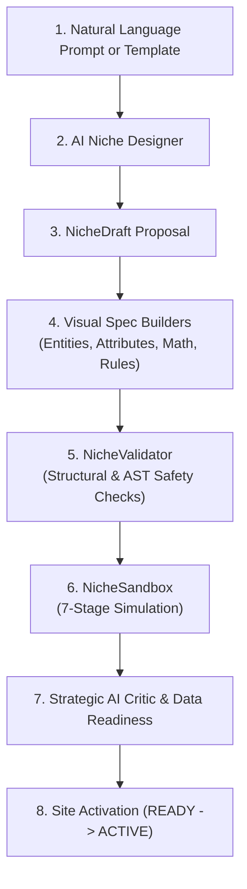

# No-Code Niche Builder & AI Niche Studio

## 1. Overview & Architecture

The **OpenSEO No-Code Niche Builder** is an end-to-end declarative system enabling non-technical users to design, validate, test, and activate high-authority programmatic data websites across any arbitrary product or engineering domain without writing a single line of Python code.

---

## 2. Step-by-Step Site Creation Wizard

Users initiate projects through the **Create New Site Wizard** via UI or API (`POST /api/v1/saas/sites/create`):

### Step 1: Basic Information & Localization
- **Site Name**: Consumer-facing brand title (e.g., *Clean Air Authority*).
- **Domain**: Target FQDN (e.g., `cleanairauthority.com`).
- **Country & Language**: Regional target (e.g., `US`, `en`).
- **Currency & Timezone**: Local commerce parameters (e.g., `USD`, `America/New_York`).

### Step 2: Business Model & Niche Selection
- **Business Model**: Affiliate, Display Ads, Lead Generation, Direct Ecommerce, or Hybrid.
- **Niche Mode Selection**:
  1. *Existing Template*: Clone from pre-tested global library (`vehicle_camping`, `coffee_equipment`, `air_purifiers`, `dog_crates`, `home_solar`, `workshop_tools`).
  2. *AI-Assisted Design*: Supply a natural language concept prompt (e.g., *"Air purifiers with CADR ratings, HEPA filter replacements, and annual power costs"*).

---

## 3. AI Niche Designer (`AINicheDesigner`)

The AI Niche Designer parses domain prompts into a comprehensive `NicheDraft` containing:
- Domain risk profile evaluation (`LOW`, `MEDIUM`, `HIGH`).
- Primary and secondary entity types.
- Curated attribute dictionaries with explicit engineering units and validation rules.
- Entity-to-entity semantic relationships.
- Deterministic calculation formulas.
- No-code fitment and compatibility rules.
- Authoritative source policies and search intent taxonomies.

---

## 4. Visual Spec Builders

| Spec Component | Purpose | Key Attributes |
|---|---|---|
| **Entity Types** | Declares core products, components, rooms, and constraints | `AirPurifier`, `Filter`, `Room`, `Pollutant` |
| **Attributes** | Models measurable technical specifications | `key`, `data_type` (12 types), `unit`, `critical`, `freshness_policy`, `preferred_source` |
| **Relationships** | Connects interacting domain entities | `source_entity`, `relationship` (`uses`, `suitable_for`, `fits_inside`), `target_entity` |
| **Calculations** | Implements physics and cost math via safe AST parser | `id`, `formula`, `output_unit`, `required_variables` |
| **Compatibility Rules** | Defines deterministic fitment matrices | `rule_id`, `conditions` (`==`, `!=`, `>`, `>=`, `<`, `<=`, `IN`, `RANGE`, `CONTAINS`), tolerances |
| **Source Policies** | Establishes citation hierarchy and freshness TTL | `source_type` (`MANUFACTURER`, `GOVERNMENT`, `CERTIFICATION`, `RETAILER`), priority 1-5 |
| **Page Types** | Defines content archetypes and intent coverage | `page_type_id`, `primary_intent`, `required_entities`, `required_attributes` |
| **Content Policy** | Enforces voice, FTC disclosures, and claim bans | `tone`, `audience`, `reading_level`, `affiliate_disclosure`, `forbidden_claims` |

---

## 5. The 7-Stage Niche Sandbox Dry-Run (`NicheSandbox`)

Before any site can be deployed or scheduled, the configuration must pass a strict 7-stage sandbox execution dry-run:

1. **Synthetic Entity Generation & Normalization**: Generates test fixtures and parses numbers into uniform SI/US units.
2. **Relationship Mapping**: Verifies that foreign keys and semantic links between entities resolve without orphans.
3. **Declarative Compatibility Evaluation**: Executes all declared fitment rules against synthetic pairs and outputs verified cards.
4. **Deterministic Formula Calculations**: Evaluates all mathematical models (`SafeFormulaEngine`) against mock data.
5. **Search Intent & Page Planner**: Simulates page blueprints for all declared page archetypes.
6. **Grounded Writer Context Assembly**: Enforces factual number whitelisting and boundaries.
7. **Quality Gate Audit**: Audits generated content against FTC disclosures, answer-first structures, tables, and hallucination checks.

---

## 6. Strategic AI Critic & Data Availability Scoring

- **AI Niche Critic (`AINicheCritic`)**: Answers the 8 architectural design questions (defensibility moat, attribute sufficiency, calculability, page intent overlap, scope width, obtainable critical facts, YMYL safety risk, and 10x value addition).
- **Data Availability Score (`DataAvailabilityScore`)**: Computes a weighted availability score (0–100) across 6 dimensions, yielding a definitive rating (`STRONG`, `MODERATE`, `WEAK`). Sites with `WEAK` data availability cannot be activated.
