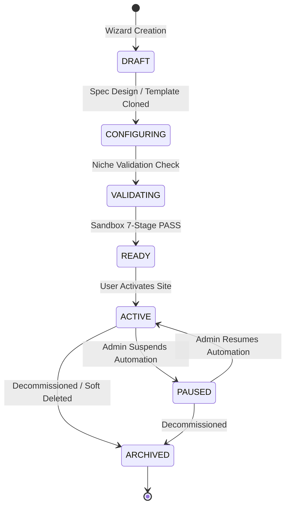

# SaaS Site Lifecycle & Operations Specification

## 1. Lifecycle Progression Overview

To prevent unfinished, hallucinated, or unverified sites from polluting search engines or consuming cloud resources, OpenSEO enforces a deterministic 7-stage state machine for every managed website:



---

## 2. Lifecycle State Definitions

| State | Allowed Operations | Background Job Execution | Description |
|---|---|---|---|
| `DRAFT` | Metadata editing, niche definition | **BLOCKED** | Fresh site created in Wizard. Incomplete data model. |
| `CONFIGURING` | Attribute, formula, and rule editing | **BLOCKED** | Active editing of schema and source policies. |
| `VALIDATING` | Schema validation, AI Critic evaluation | **BLOCKED** | Structural integrity and formula AST safety checks running. |
| `READY` | Pre-launch inspection, credential setup | **BLOCKED** | Successfully passed 7-stage Sandbox simulation. |
| `ACTIVE` | Normal production workflows | **PERMITTED** | Live production state. Scheduled research & drafts run here. |
| `PAUSED` | Read-only dashboards, metric review | **BLOCKED** | Temporarily halted by operator or billing freeze. |
| `ARCHIVED` | Audit review, export | **BLOCKED** | Deprecated site. Automation and scrapers permanently halted. |

---

## 3. Strict Automation Execution Rule

> [!IMPORTANT]
> **Production Gate**: `SaaSSiteManager.can_schedule_jobs(site_id)` evaluates to `True` **ONLY** when `site.lifecycle_status == SiteLifecycleStatus.ACTIVE`.
> Any attempt by automated worker queues (SERP research, ingestion, content drafts, or WordPress publish) to run for sites in `DRAFT`, `CONFIGURING`, `VALIDATING`, `READY`, `PAUSED`, or `ARCHIVED` is rejected at the scheduler level.

---

## 4. Multi-Tenant Role-Based Access Control (RBAC)

Site lifecycle state transitions require strict role verification via `SaaSSiteManager.verify_permission()`:

- **`OWNER`**: Complete control over site lifecycle, billing, credentials, and deletion.
- **`ADMIN`**: Can modify configurations, run sandbox tests, and toggle `ACTIVE` / `PAUSED` states.
- **`EDITOR`**: Can view configurations, run sandbox dry runs, and propose edits to drafts. Cannot activate sites.
- **`VIEWER`**: Read-only access to scoped dashboards and telemetry metrics.

---

## 5. Site Switcher & Scoped Telemetry

### Context Switching
Users working in multi-site agencies switch active sites via `POST /api/v1/saas/context/switch`:
```json
{
  "site_id": "site_cleanairauthority_com",
  "user_id": "user_agency_admin"
}
```
All subsequent UI interactions, data authority tables, and draft generations automatically inherit the active site's profile, affiliate credentials, and niche schemas.

### Telemetry Scoping
- **Scoped Dashboard (`GET /api/v1/saas/sites/{site_id}/dashboard`)**: Returns isolated metrics for the selected site: entities count, sources, page plans, drafts, published articles, GSC impressions, and masked credentials.
- **Global Overview Dashboard (`GET /api/v1/saas/dashboard/global`)**: Aggregates tenant-wide telemetry across all active and staged properties.
